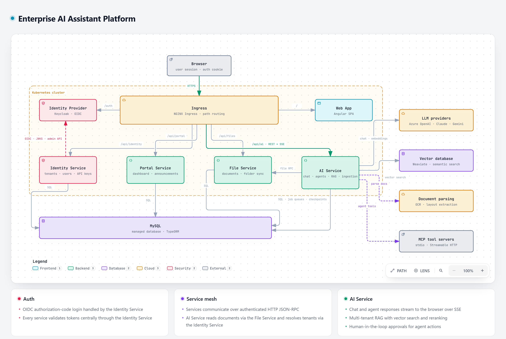

# Enterprise AI Assistant with RAG & AI Agents

**Multi-tenant AI chat, document search and agent platform with human-in-the-loop approval.**

**[View the interactive architecture diagram](https://shayanakhtar.github.io/ai-platform-architecture/)**: zoom and pan, switch between light and dark themes, play the request trace animation, trace paths, and export to PNG or SVG.

> This repository hosts the architecture diagram of a production system built for an industrial AI software provider. The application source code is private. Names of the client and internal infrastructure have been left out.

---

## The problem

Companies want their teams to use AI on their own knowledge: manuals, specifications, procedures and internal documents. A plain chatbot is not enough. Each customer company needs its own isolated data and users, answers must come from its documents rather than the model's guesses, and AI agents that take actions with real tools must not do so unchecked.

## The solution

The platform has three parts:

1. **AI chat and assistants** that answer questions from a company's own documents (RAG) and stream answers live as they are written.
2. **AI agents** that run multi-step workflows and call external tools through MCP, with a person approving sensitive actions before they run.
3. **A document pipeline** that ingests, parses and indexes uploaded and synced files so they become searchable.

Each customer company is a separate tenant with its own users, documents and settings.

## Architecture walkthrough

| # | Stage | What happens |
|---|-------|--------------|
| 1 | **Entry** | The browser reaches the cluster over HTTPS. An **NGINX ingress** routes `/` to the Angular app, `/auth` to Keycloak, and `/api/*` paths to each backend service. |
| 2 | **Sign-in** | The **Identity Service** runs the OIDC authorization-code flow against **Keycloak** and sets a session cookie. It also manages tenants, users and API keys through the Keycloak admin API. |
| 3 | **Token check** | Every service validates incoming tokens centrally by calling the Identity Service, which verifies them against Keycloak's signing keys (JWKS). |
| 4 | **Chat request** | The **AI Service** builds the prompt, retrieves relevant passages from **Weaviate** (vector search, then reranking) and calls the chosen model: **Azure OpenAI, Claude or Gemini**. |
| 5 | **Live answer** | The response streams back to the browser token by token over **Server-Sent Events (SSE)**. |
| — | **Agents** | Agents run as **LangGraph** graphs. They call tools on **MCP servers**, either spawned locally (stdio) or remote (Streamable HTTP with OAuth). |
| — | **Human review** | When an agent reaches a sensitive action, the graph pauses. A user approves or rejects it in the app, and the graph resumes from its saved checkpoint. Auto-approve rules can skip review for trusted actions. |
| — | **Document ingestion** | Files are stored by the **File Service**. The AI Service fetches them, parses them with document-intelligence and OCR services, splits them into chunks, creates embeddings and indexes them in Weaviate. |

### Inter-service communication

Backend services talk to each other over an internal HTTP JSON-RPC layer secured with a shared secret. For example, the AI Service reads documents from the File Service and resolves tenants through the Identity Service.

## Tech stack

| Layer | Technologies |
|-------|--------------|
| Frontend | Angular 18, TypeScript, PrimeNG |
| Backend services | NestJS, TypeScript, TypeORM, Nx monorepo |
| AI | LangChain, LangGraph, MCP, Azure OpenAI, Claude, Gemini, Whisper (speech-to-text) |
| RAG | Weaviate vector database, OpenAI embeddings, reranking, document-intelligence and OCR parsing |
| Data | MySQL 8 (application data, job queues, agent checkpoints), persistent volumes for files |
| Auth & security | Keycloak (OIDC SSO), centralized token validation, API keys, shared-secret service auth |
| Delivery | Kubernetes, NGINX ingress, cert-manager, Terraform, Prometheus and Loki monitoring |
| Observability | Langfuse (LLM tracing) |

## Key design decisions

- **Human in the loop:** agent actions can be paused for approval, and LangGraph checkpoints let a paused run resume exactly where it stopped.
- **Answers grounded in documents:** retrieval and reranking over each tenant's own documents keep answers tied to company knowledge.
- **Multi-tenant by design:** every request carries a tenant, and each tenant's users, files and settings are kept separate.
- **Model-agnostic:** one LangChain layer switches between Azure OpenAI, Claude and Gemini without changing application code.
- **One place for auth:** token validation lives only in the Identity Service, so the other services share a single, consistent auth check.
- **Simple infrastructure:** job queues and agent checkpoints are stored in MySQL, so the system needs no separate message broker or Redis.

## About the diagram

The diagram was generated with [Archify](https://github.com/tt-a1i/archify) from a typed JSON specification traced against the real codebase. `index.html` is a single self-contained file with no external dependencies.
